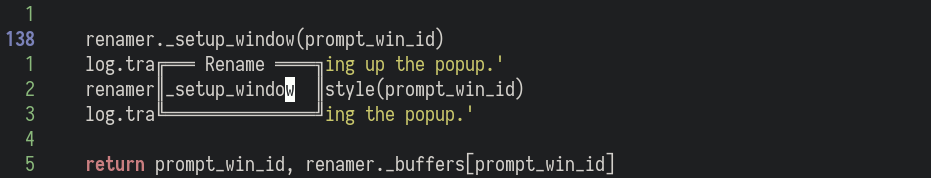
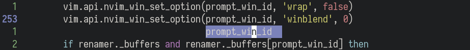
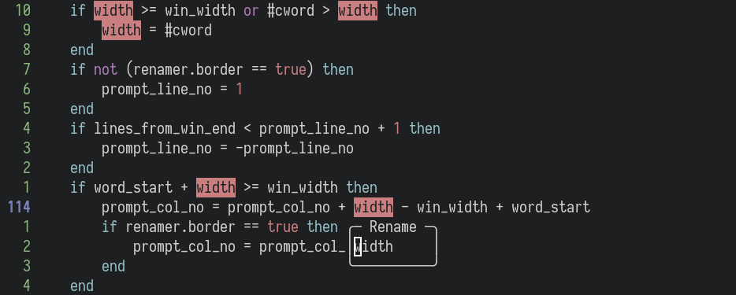
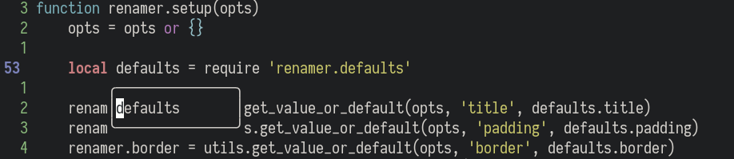
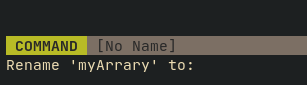

[](https://github.com/filipdutescu/renamer.nvim/actions/workflows/ci_master.yaml)
[](https://github.com/filipdutescu/renamer.nvim/actions/workflows/ci.yaml)
[](https://github.com/filipdutescu/renamer.nvim/releases)

# renamer.nvim


`renamer.nvim` is a Visual-Studio-Code-like renaming UI for Neovim, writen in
Lua. It is considerably customizable and uses the [Neovim >= 0.5.0](https://github.com/neovim/neovim/releases/tag/v0.5.0)
LSP feature as its backend.

## Table of contents

- [Features](#features)
- [Getting started](#getting-started)
- [Usage](#usage)
- [Customization](#customization)
- [Default mappings](#default-mappings)
- [Media](#media)
- [Contributing](#contributing)
- [License](#license)

## Features

- **Lightweight:** the overhead of this plugin is insignificant and it makes use
  of existent features or plugins you most likely already have installed (only
  [plenary.nvim](https://github.com/nvim-lua/plenary.nvim) required).
- **Responsive UI:** takes into account the cursor position and where the popup
  will be place relative to the current window to adjust the its placement.
- **[Neovim >= 0.5.0](https://github.com/neovim/neovim/releases/tag/v0.5.0) LSP**:
  uses the Neovim LSP to rename across scopes and project.
- **Popup customization**: provides several ways to integrate the popup with
  your specific setup, from border characters and title to its colours.
- **References highlighting:** of the word to be renamed, using Neovim's LSP (see
  [References highlighting](#references-highlighting))
- **Keymaps:** predefined keymaps to help you navigate and manipulate the popup

## Getting started

In order to start using `renamer.nvim` you will need to follow the following
sections. If you already meet certain requirements (such as already having
[plenary.nvim](https://github.com/nvim-lua/plenary.nvim)), then you only need to
install `renamer.nvim`.

### Prerequisites

To use `renamer.nvim`, since it makes use of
[Neovim](https://github.com/neovim/neovim)'s built-in LSP, you will need to have
installed [Neovim v0.5.0](https://github.com/neovim/neovim/releases/tag/v0.5.0)
or [newer](https://github.com/neovim/neovim/releases/latest).

### Installation

Using [vim-plug](https://github.com/junegunn/vim-plug):

```viml
Plug 'nvim-lua/plenary.nvim'
Plug 'filipdutescu/renamer.nvim', { 'branch': 'master' }
```

Using [dein](https://github.com/Shougo/dein.vim)

```viml
call dein#add('nvim-lua/plenary.nvim')
call dein#add('filipdutescu/renamer.nvim', { 'rev': 'master' })
```
Using [packer.nvim](https://github.com/wbthomason/packer.nvim)

```lua
use {
  'filipdutescu/renamer.nvim',
  branch = 'master',
  requires = { {'nvim-lua/plenary.nvim'} }
}
```

### Verify your installation

After those steps, you should be able to run `:checkhealth renamer` in order to
see if anything is missing from your setup.

After following the steps above, either continue reading below or run `:help
renamer` to get an understanding of the next steps required to use `renamer.nvim`
and how to configure it.

## Usage

To rename the current word using `renamer.nvim`, you need to call the `rename`
method (`require('renamer').rename()`).

The recommended way of doing it is by setting up keybindings to call the function:

VimScript:

```viml
inoremap <silent> <F2> <cmd>lua require('renamer').rename()<cr>
nnoremap <silent> <leader>rn <cmd>lua require('renamer').rename()<cr>
vnoremap <silent> <leader>rn <cmd>lua require('renamer').rename()<cr>
```

Lua:

```lua
vim.api.nvim_set_keymap('i', '<F2>', '<cmd>lua require("renamer").rename()<cr>', { noremap = true, silent = true })
vim.api.nvim_set_keymap('n', '<leader>rn', '<cmd>lua require("renamer").rename()<cr>', { noremap = true, silent = true })
vim.api.nvim_set_keymap('v', '<leader>rn', '<cmd>lua require("renamer").rename()<cr>', { noremap = true, silent = true })
```

## Customization

`renamer.nvim` offers different customization options, in order to change its
appearance and behaviour. Below you will find the defaults and the structure
of the settings table.

### Renamer setup structure

```lua
local mappings_utils = require('renamer.mappings.utils')
require('renamer').setup {
    -- The popup title, shown if `border` is true
    title = 'Rename',
    -- The padding around the popup content
    padding = {
        top = 0,
        left = 0,
        bottom = 0,
        right = 0,
    },
    -- The minimum width of the popup
    min_width = 15,
    -- The maximum width of the popup
    max_width = 45,
    -- Whether or not to shown a border around the popup
    border = true,
    -- The characters which make up the border
    border_chars = { '─', '│', '─', '│', '╭', '╮', '╯', '╰' },
    -- Whether or not to highlight the current word references through LSP
    show_refs = true,
    -- Whether or not to add resulting changes to the quickfix list
    with_qf_list = true,
    -- Whether or not to enter the new name through the UI or Neovim's `input`
    -- prompt
    with_popup = true,
    -- The keymaps available while in the `renamer` buffer. The example below
    -- overrides the default values, but you can add others as well.
    mappings = {
        ['<c-i>'] = mappings_utils.set_cursor_to_start,
        ['<c-a>'] = mappings_utils.set_cursor_to_end,
        ['<c-e>'] = mappings_utils.set_cursor_to_word_end,
        ['<c-b>'] = mappings_utils.set_cursor_to_word_start,
        ['<c-c>'] = mappings_utils.clear_line,
        ['<c-u>'] = mappings_utils.undo,
        ['<c-r>'] = mappings_utils.redo,
    },
    -- Custom handler to be run after successfully renaming the word. Receives
    -- the LSP 'textDocument/rename' raw response as its parameter.
    handler = nil,
}
```

Colours can also be changed, in order to better fit your theme or taste. The
following highlight groups can also be modified to theme the popup colours:

```viml
hi default link RenamerNormal Normal
hi default link RenamerBorder RenamerNormal
hi default link RenamerTitle Identifier
```

### References highlighting

`renamer.nvim` also **highlights the current text** wherever it is used in the
current document, using `vim.lsp.buf.document_highlight()`. In order for it to
be visible, the `LspReferenceText`, `LspReferenceRead` and `LspReferenceWrite`
highlight groups need to be defined (see the
[`vim.lsp.buf.document_highlight()`](https://neovim.io/doc/user/lsp.html#vim.lsp.buf.document_highlight())
documentation for details).

### Renamer rename structure

```lua
require('renamer').rename {
    -- Defines whether or not the popup should contain the initial word or be
    -- empty
    empty = false,
}
```

## Default mappings

Mappings are fully customizable. The default mappings are intended to be familiar
to users and mimic the default behaviour of their normal mode equivalents.

| Mappings | Action                       |
|----------|------------------------------|
| `<c-i>`  | Go to the start of the line. |
| `<c-a>`  | Go to the end of the line.   |
| `<c-e>`  | Go to the end of the word.   |
| `<c-b>`  | Go to the start of the word. |
| `<c-c>`  | Clear the buffer line.       |
| `<c-u>`  | Undo changes.                |
| `<c-r>`  | Redo undone changes.         |

To change existing mappings or add new ones, the value needed to be passed in the
mappings field is a Lua function. Here is an example of how to change `<c-c>`'s
behaviour from clearing the line to closing the popup:

```lua
-- other setup code...

['<c-c>'] = function()
    vim.api.nvim_input('<esc>')
end

-- other setup code...
```

## Media

Here are some examples of various parts of `renamer.nvim` that you can
customize, to hopefully give you a better idea of how to integrate the plugin
and maybe convince you to start using it.

- **Demo:**


- **Border customization:**



or no border:



- **Highlight references:**



- **No title:**



- **No popup:**



Thanks [@sdushantha](https://github.com/sdushantha) for suggesting this (and
providing the screenshot)!

## Contributing

All contributions are welcome! Just open a pull request or an issue. Please read
[CONTRIBUTING.md](CONTRIBUTING.md).

## License

This project is licensed under the
[Apache 2.0 License](https://www.apache.org/licenses/LICENSE-2.0) - see the
[LICENSE](LICENSE) file for details

